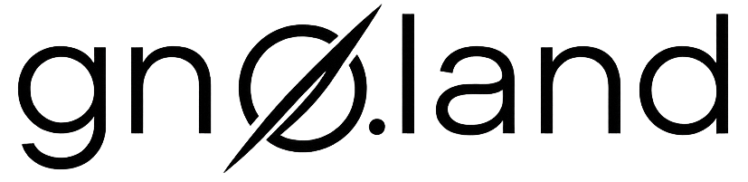

{width=500px lazy}

# 2 - Hello Gno World 🌍
What’s Gno?
Build and publish your first dApp

<!--
Deployed online your first simple dApp

What is possible in Gno compared to Go
How to import already made package

Créer le contenu d'un dApp simple, avec des fonctinonalites + ou - avancé
Platforme de messagerie publique, feed
Une liste de message, avec un blockstamp, et un auteur

Utilisation de librairie online 
Créer une clé avec gnokey
Deploiement du contrat sur la test net

- Learn what makes Gno different from Go
- Build and deploy your first simple contract
- Understand basic smart contract structure and deployment tools
-->

---
# **Gno** vs **Go** ?
- Familiar **syntax** and **standard library**.

### Key differences:
- ✅ **Deterministic execution**
- ✅ Built-in **smart contract support**
- 🚫 **No external network access**
- 🚫 **No goroutines** (yet !)

---

## 📢 Let's build a Public Blog Platform
### ✨ Features:
  - A **public message feed** (anyone can post)
- Each message has:
```go
type Message struct {
    Title   string
    Content string
    Author  std.Address
    CreatedAt time.Time
}

<!--
Gno is designed for blockchain applications
Go for general purpose

(no randomness or time-based logic)
 (for security and reproducibility)
-->


```

---
<!--
_class: lead
-->
# Let's code it !

<!-- 

Explain how to render
Explain the data 
How to add new post then
Check result using gnodev everytime

Next time, let's deploy and test next episode
-->

<!--
-> Let's deploy and test your smart contract !

First we need to create a private key using gnokey
gnokey add mykey
We can securely manage private keys

Then let's deploy it on the deployed net

Let's get token

gnoland tx call "publish_message" --args "Hello, Gno!"


-->
