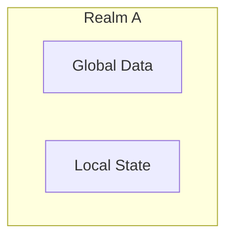
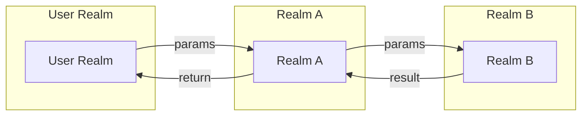
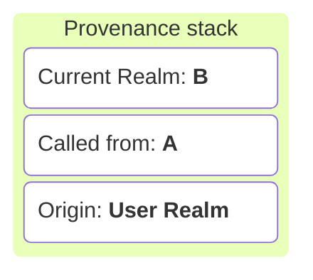
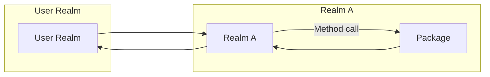
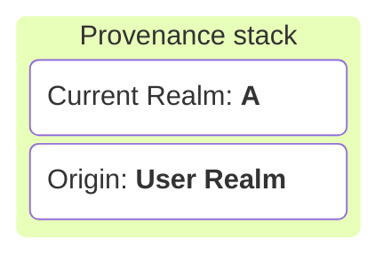
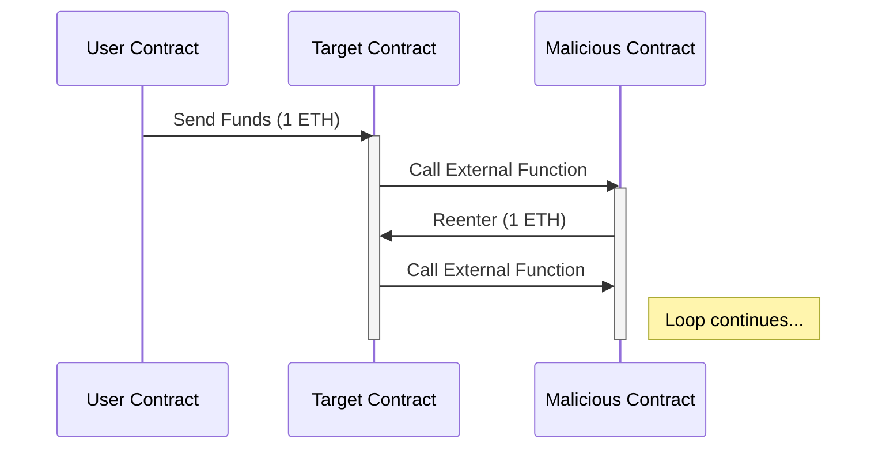
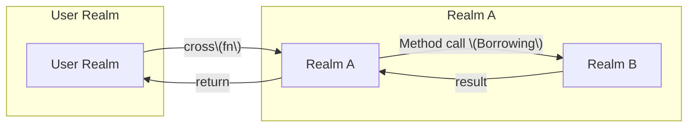
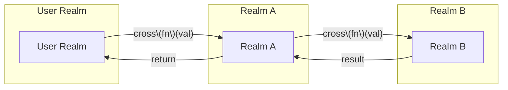

```mermaid

flowchart LR

%% Normal State
subgraph Normal_State["Normal Transaction"]
    C1["C"] --[$1]--> A1["A"]
    A1 --> B1["B"]
    B1 -- Return --> A1
    A1 --[transaction_complete]--> C1
end

%% Reentrancy Attack
subgraph Reentrancy_Attack["Reentrancy Attack"]
    A2["A"] --[$1]--> B2["B"]
    B2 --> A2r1["A (reentered)"]
    A2r1 --[$1]--> B2r1["B (reentered)"]
    B2r1 --> A2r2["A (reentered again)"]
    A2r2 --[$1]--> B2r2["B (loop...)"]
end

%% Borrowing (Safe)
subgraph Borrowing_Method["Borrowing Pattern (Safe)"]
    C3["C"] --[$1]--> A3["A"]
    A3 --> B3["{B()} (internal method)"]
    A3 --[transaction_complete]--> C3
end

%% Explicit External Call (Original)
subgraph Explicit_Call["Original (Cross-Realm Call)"]
    C4["C"] --[$1]--> A4["A"]
    A4 -. cross call .-> B4["B"]
    B4 -- Return --> A4
    A4 --[transaction_complete]--> C4
end

%% Specific Case: Receiver Reentrancy
subgraph Receiver_Reentrancy["Receiver Reentrancy"]
    C5["C"] --[$1]--> A5["A"]
    A5 -. cross call .-> B5["B"]
    B5 -. cross call .-> A5r["A (reentered)"]
    A5r -. cross call .-> B5r["B (again)"]
    B5r -- Return --> A5r
    A5r -- Return --> B5
    B5 -- Return --> A5
    A5 --[transaction_complete]--> C5
end

%% Specific Case: Package Call
subgraph Package_Call["Calling a Package"]
    C6["C"] --[$1]--> A6["A"]
    A6 --> P6["{P()} (internal call like borrowing)"]
    A6 --[transaction_complete]--> C6
end
```

{width=450px}

# Interrealm in Gno 🌐

A deep dive into Gno’s realm system and rules

---

# Overview

* **What is a Realm?**
* **Borrowing vs. Crossing**
* **Key Rules & Best Practices**
* **Code Examples**
* **Why Interrealm Matters**

---

# What is a Realm?

* A **realm** is an isolated execution and storage context — like its own world 🌍
* Each realm has:
  - Its own **state and authority**
  - Rules for **entry**, **exit**, and **data modification**
* Realms enforce:
  - **Security**, **Traceability** and **Isolation** 



---

# Interrealm Flow

### Realm method call





---

# Interrealm Flow

### Package method call




---

# But it instaure crucial flaw - Reentrency attack


---

# Let's introduce **Borrowing**
### Less permissive call for a more secure environment.

* **Borrowing** = calling a method on an object in another realm.
* You **implicitly visit** the object's realm for that method call.
* You can **read and modify** the receiver and its reachable state.
* **Limit**: You cannot freely create new root-level objects.

---

# Interrealm Flow (Borrowing)




---

# Crossing

* **Explicitly switch** into another realm.
* **Crossing** = `cross(fn)(...)` or functions marked with `crossing()`.
* Gain full **write access** to the realm’s global storage like it used to.
* Use for **creating new objects** or performing realm-specific logic.

---


# Interrealm Flow (Crossing)




---

# Inter-realm Flow (Crossing)

#### Realm A
````md magic-move
```go
func CallCreatePost(title, content string) {
    CreatePost(title, content)
}
```
```go
func CallCreatePost(title, content string) {
    cross(CreatePost)(title, content)
}
```
````

#### Realm B
````md magic-move
```go
func CreatePost(title, content string) {
	newPost := Post{
		Title: title,
        Content: content,
	}
	Posts = append(Posts, *newPost)
}
```
```go
func CreatePost(title, content string) {
    crossing()
	newPost := Post{
		Title: title,
        Content: content,
	}
	Posts = append(Posts, *newPost)
}
```
````


---



---

# Rules Summary

| Action                        | Borrowing                 | Crossing                        |
| ----------------------------- | ------------------------- | ------------------------------- |
| Modify existing object        | ✅ via method call         | ✅                               |
| Create new unattached object  | ❌                         | ✅                               |
| Implicit realm context change | No (temporary for method) | Yes (permanent inside fn)       |
| Method syntax                 | `obj.Method()`            | `cross(fn)(...)` + `crossing()` |

---

# Code Example: Borrowing

```go
// In realmB
func (b *Book) SetTitle(new string) {
  b.Title = new  // Allowed: borrowing b’s realm
}

// In realmA
book := &realmB.Book{}
book.SetTitle("Hello Gno")
```

---

# Code Example: Crossing

```go
// In realmB
func CreateUser(name string) {
  crossing()
  user := &User{Name: name}
  users[name] = user  // Global storage in realmB
}

// In realmA
cross(realmB.CreateUser)("alice")
```

---

# Why Interrealm Matters

::: columns
::: column
**Interrealm mechanics aren't just an abstraction — they enforce Gno's core values:**

- 🔐 **Security**  
  Restrict unauthorized writes and state mutation.
- 🧱 **Isolation**  
  Keeps logic and data siloed, preventing unintended coupling.
- 🕵️‍♀️ **Traceability**  
  You always know *who called what and where*.
- 🔁 **Upgradeability**  
  Mutable realms (code you own) vs. p-packages (immutable dependencies).
:::

::: column
{width=200px}
:::

---

# Best Practices

1. Default to **non-crossing** methods.
2. Use **borrowing** for object-specific ops.
3. Reserve **crossing** for realm-level state changes.
4. Always mark public crossable functions with `crossing()`.

---

# Summary

* **Realms** = isolated worlds.
* **Borrowing** = temporary, object-scoped access.
* **Crossing** = explicit realm switch for full access.
* Choose the right approach for **security** and **clarity**.
