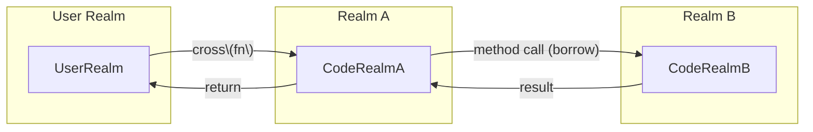

{width=450px}

# Interrealm in Gno 🌐

A deep dive into Gno’s realm system and rules

---

# Overview

* **What is a Realm?**
* **Borrowing vs. Crossing**
* **Key Rules & Best Practices**
* **Code Examples**
* **Why Interrealm Matters**

---

# What is a Realm?

* A **realm** is an isolated execution and storage context.
* Think of it as a **separate world** with its own authority and state.
* Realms help enforce **security**, **isolation**, and **traceability**.

---

# Interrealm Flow




# Stack & Implicit Crossing

```mermaid
graph TD
  A[User starts transaction] --> B[main() in Realm A]
  B --> C[cross(fn) to Realm B]
  C --> D[Realm B runs with new frame]
  D --> E[Return to Realm A]
```

---

# Borrowing

* **Borrowing** = calling a method on an object in another realm.
* You **implicitly visit** the object's realm for that method call.
* You can **read and modify** the receiver and its reachable state.
* **Limit**: You cannot freely create new root-level objects.

---

# Crossing

* **Crossing** = `cross(fn)(...)` or functions marked with `crossing()`.
* **Explicitly switch** into another realm.
* Gain full **write access** to the realm’s global storage.
* Use for **creating new objects** or performing realm-specific logic.

---

# Rules Summary

| Action                        | Borrowing                 | Crossing                        |
| ----------------------------- | ------------------------- | ------------------------------- |
| Modify existing object        | ✅ via method call         | ✅                               |
| Create new unattached object  | ❌                         | ✅                               |
| Implicit realm context change | No (temporary for method) | Yes (permanent inside fn)       |
| Method syntax                 | `obj.Method()`            | `cross(fn)(...)` + `crossing()` |

---

# Code Example: Borrowing

```go
// In realmB
func (b *Book) SetTitle(new string) {
  b.Title = new  // Allowed: borrowing b’s realm
}

// In realmA
book := &realmB.Book{}
book.SetTitle("Hello Gno")
```

---

# Code Example: Crossing

```go
// In realmB
func CreateUser(name string) {
  crossing()
  user := &User{Name: name}
  users[name] = user  // Global storage in realmB
}

// In realmA
cross(realmB.CreateUser)("alice")
```

---

# Why Interrealm Matters

* **Security**: Prevent unauthorized writes.
* **Isolation**: Keep state separated.
* **Traceability**: Know exactly where actions occur.
* **Upgradeability**: Mutable realms vs. immutable p-packages.

---

# Best Practices

1. Default to **non-crossing** methods.
2. Use **borrowing** for object-specific ops.
3. Reserve **crossing** for realm-level state changes.
4. Always mark public crossable functions with `crossing()`.

---

# Summary

* **Realms** = isolated worlds.
* **Borrowing** = temporary, object-scoped access.
* **Crossing** = explicit realm switch for full access.
* Choose the right approach for **security** and **clarity**.
